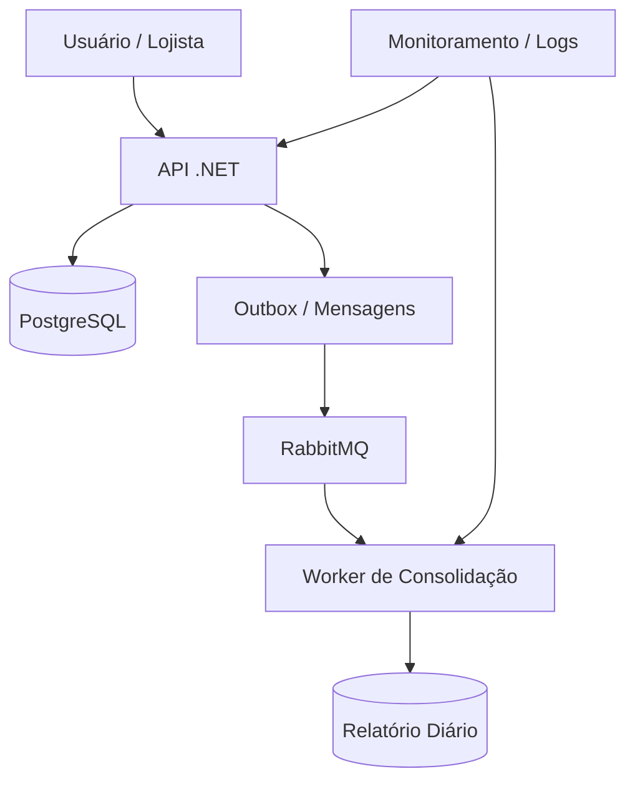

# Fluxo de Caixa App

Sistema para gestão financeira de um lojista, com foco em controlar lançamentos de crédito e débito, além de calcular o saldo consolidado diário.

## Objetivo

A aplicação permite:
- registrar lançamentos financeiros do dia a dia;
- distinguir entre crédito e débito;
- consultar os lançamentos cadastrados;
- gerar o saldo diário consolidado;
- manter a operação principal funcionando mesmo quando o processo de consolidação diária falha ou fica lento.

## Arquitetura da solução

A solução foi pensada para manter alta disponibilidade e tolerância a falhas, utilizando uma arquitetura distribuída em camadas:



### Como a solução funciona

1. O lojista faz uma requisição para registrar um lançamento via API.
2. A API salva o lançamento no banco de dados.
3. A mensagem do evento é armazenada no Outbox para garantir consistência.
4. Um processo em background publica essa mensagem em uma fila RabbitMQ.
5. O worker consome a fila e processa a consolidação do dia.
6. O saldo diário pode ser consultado sem bloquear a operação principal.

Essa abordagem reduz a dependência direta entre o cadastro e a consolidação, aumentando a resiliência da aplicação.

---

## Requisitos prévios

Antes de rodar a aplicação localmente, confirme que você tem instalado:

- .NET 8 SDK
- PostgreSQL
- RabbitMQ
- Git
- IDE recomendada: Visual Studio 2022 ou VS Code

### Verificação rápida

No terminal, rode:

```bash
dotnet --version
psql --version
rabbitmq-diagnostics -q ping
```

Se os comandos acima não forem reconhecidos, instale os componentes antes de continuar.

---

## Preparando o ambiente local

### 1) Banco de dados PostgreSQL

Crie um banco de dados chamado `fluxocaixa`:

```sql
CREATE DATABASE fluxocaixa;
```

Se estiver usando um container Docker, pode subir o PostgreSQL com o comando:

```bash
docker run -d \
  --name postgres-fluxo \
  -e POSTGRES_USER=postgres \
  -e POSTGRES_PASSWORD=postgres \
  -e POSTGRES_DB=fluxocaixa \
  -p 5432:5432 \
  postgres:16
```

### 2) RabbitMQ

Suba o RabbitMQ localmente:

```bash
docker run -d \
  --name rabbitmq-fluxo \
  -p 5672:5672 \
  -p 15672:15672 \
  rabbitmq:3-management
```

Depois, a interface web do RabbitMQ estará disponível em:

```text
http://localhost:15672
```

Credenciais padrão:
- usuário: `guest`
- senha: `guest`

---

## Estrutura do projeto

A solução deve ser organizada de forma simples, mas com responsabilidades bem separadas:

```text
FluxoCaixaApp/
├── FluxoCaixaApp.Api/
│   ├── Controllers/
│   ├── Data/
│   ├── Models/
│   ├── Messages/
│   ├── Services/
│   ├── Background/
│   ├── Program.cs
│   └── appsettings.json
├── FluxoCaixaApp.Worker/
│   ├── Program.cs
│   └── appsettings.json
├── FluxoCaixaApp.Tests/
│   └── FluxoCaixaTests.cs
├── FluxoCaixaApp.sln
├── README.md
└── .gitignore
```

---

## Configuração das conexões

No arquivo `appsettings.json` da API, configure a string de conexão do PostgreSQL:

```json
{
  "ConnectionStrings": {
    "DefaultConnection": "Host=localhost;Port=5432;Database=fluxocaixa;Username=postgres;Password=postgres"
  },
  "RabbitMQ": {
    "HostName": "localhost",
    "UserName": "guest",
    "Password": "guest",
    "QueueName": "fluxocaixa.lancamentos"
  }
}
```

No worker, configure a mesma fila e as credenciais do RabbitMQ:

```json
{
  "RabbitMQ": {
    "HostName": "localhost",
    "UserName": "guest",
    "Password": "guest",
    "QueueName": "fluxocaixa.lancamentos"
  }
}
```

---

## Criação da solução e dos projetos

No terminal, execute os passos abaixo:

```bash
mkdir FluxoCaixaApp
cd FluxoCaixaApp

dotnet new sln -n FluxoCaixaApp

dotnet new webapi -n FluxoCaixaApp.Api -f net8.0
dotnet new console -n FluxoCaixaApp.Worker -f net8.0
dotnet new xunit -n FluxoCaixaApp.Tests -f net8.0

dotnet sln FluxoCaixaApp.sln add \
  FluxoCaixaApp.Api/FluxoCaixaApp.Api.csproj \
  FluxoCaixaApp.Worker/FluxoCaixaApp.Worker.csproj \
  FluxoCaixaApp.Tests/FluxoCaixaApp.Tests.csproj
```

Em seguida, adicione as dependências:

```bash
dotnet add FluxoCaixaApp.Api/FluxoCaixaApp.Api.csproj package Microsoft.EntityFrameworkCore
dotnet add FluxoCaixaApp.Api/FluxoCaixaApp.Api.csproj package Microsoft.EntityFrameworkCore.Design
dotnet add FluxoCaixaApp.Api/FluxoCaixaApp.Api.csproj package Npgsql.EntityFrameworkCore.PostgreSQL
dotnet add FluxoCaixaApp.Api/FluxoCaixaApp.Api.csproj package RabbitMQ.Client

dotnet add FluxoCaixaApp.Worker/FluxoCaixaApp.Worker.csproj package RabbitMQ.Client
dotnet add FluxoCaixaApp.Worker/FluxoCaixaApp.Worker.csproj package Microsoft.Extensions.Hosting

dotnet add FluxoCaixaApp.Tests/FluxoCaixaApp.Tests.csproj reference FluxoCaixaApp.Api/FluxoCaixaApp.Api.csproj
```

---

## Criação das migrações e banco

Após a criação dos modelos e do DbContext, rode:

```bash
dotnet ef migrations add InitialCreate --project FluxoCaixaApp.Api --startup-project FluxoCaixaApp.Api
dotnet ef database update --project FluxoCaixaApp.Api --startup-project FluxoCaixaApp.Api
```

Se o comando `dotnet ef` não for encontrado, instale a ferramenta globalmente:

```bash
dotnet tool install --global dotnet-ef
```

---

## Como rodar a aplicação localmente

### 1) Restaurar dependências

```bash
dotnet restore
```

### 2) Compilar a solução

```bash
dotnet build
```

### 3) Executar a API

```bash
dotnet run --project FluxoCaixaApp.Api
```

A API deve subir em:

```text
https://localhost:5001
http://localhost:5000
```

Se a porta exata variar, consulte a saída do console.

### 4) Acessar o Swagger

Abra no navegador:

```text
https://localhost:5001/swagger
```

### 5) Executar o worker de consolidação

Em outro terminal, rode:

```bash
dotnet run --project FluxoCaixaApp.Worker
```

Esse worker fica ouvindo a fila de mensagens e processando a consolidação do saldo diário.

---

## Endpoints principais

### Registrar lançamento

```http
POST /api/FluxoCaixa
Content-Type: application/json
```

Exemplo:

```json
{
  "data": "2026-09-17",
  "tipo": 1,
  "descricao": "Venda em dinheiro",
  "categoria": "Vendas",
  "valor": 300.00
}
```

### Listar lançamentos

```http
GET /api/FluxoCaixa
```

### Consultar saldo diário

```http
GET /api/FluxoCaixa/saldo-diario/2026-09-17
```

Exemplo de resposta:

```json
{
  "data": "2026-09-17T00:00:00",
  "totalCreditos": 500.00,
  "totalDebitos": 200.00,
  "saldoConsolidado": 300.00,
  "quantidadeLancamentos": 2
}
```

---

## Modo de funcionamento da aplicação

### Fluxo principal

1. O lojista registra um lançamento financeiro.
2. A API valida os dados do lançamento.
3. O registro é salvo no banco PostgreSQL.
4. Um evento do tipo `LancamentoRegistrado` é escrito no Outbox.
5. O publisher publica a mensagem em RabbitMQ.
6. O worker recebe a mensagem e atualiza o cálculo do saldo diário.
7. O usuário pode consultar o saldo consolidado sem precisar esperar o processamento síncrono.

### Resiliência da solução

A arquitetura foi planejada para que a operação principal continue funcionando mesmo quando:
- a rotina de consolidação falha;
- a fila está sob carga;
- há pico de requisições;
- o worker fica temporariamente indisponível.

Isso acontece porque o lançamento é persistido imediatamente no banco e o processamento de relatório acontece em um segundo plano assíncrono.

---

## Testes automatizados

Os testes devem cobrir regras de negócio e validações críticas:
- registro de crédito;
- registro de débito;
- rejeição de valor inválido;
- cálculo do saldo consolidado;
- processamento assíncrono.

Para rodar os testes:

```bash
dotnet test
```

---

## Boas práticas aplicadas

A solução foi pensada com foco em engenharia de software moderna, incluindo:

- Clean Code
- Separação de responsabilidades
- Injeção de dependência
- Repository Pattern
- Mensageria assíncrona
- Tratamento de erros
- Validação centralizada de regras de negócio
- Testes automatizados

---

## Requisitos de desempenho e tolerância

O desenho considera um cenário com pico de até 50 requisições por segundo, com foco em:
- processamento assíncrono da consolidação;
- desacoplamento da API do worker;
- redução de tempo de resposta no cadastro;
- idempotência para evitar processamento duplicado;
- retry e fila persistente para reduzir perda de mensagens.

---

## Melhorias futuras

Como evolução futura, recomenda-se:
- usar Docker Compose para subir PostgreSQL e RabbitMQ em conjunto;
- integrar observabilidade com logs estruturados e métricas;
- adicionar autenticação e autorização;
- criar interface web para dashboard financeiro;
- persistir saldos por período e por categoria;
- migrar para solução de mensageria mais robusta, como Azure Service Bus.

> O Docker foi mantido como possibilidade de melhoria futura para não bloquear a execução local simples da aplicação.

---

## Publicando no GitHub

Depois que tudo estiver funcionando localmente, pode publicar no GitHub com os comandos:

```bash
git init
git add .
git commit -m "Versão inicial do Fluxo de Caixa"
git branch -M main
git remote add origin <URL_DO_REPOSITORIO>
git push -u origin main
```

---

## Resumo

Essa solução atende ao problema do cliente porque oferece:
- controle do fluxo de caixa;
- registro de entradas e saídas;
- cálculo do saldo consolidado diário;
- arquitetura resiliente para picos e falhas;
- execução local simples em .NET, PostgreSQL e RabbitMQ.
